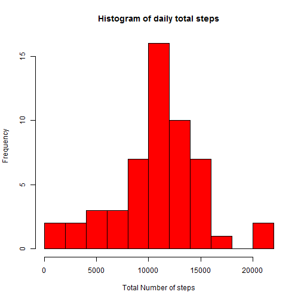
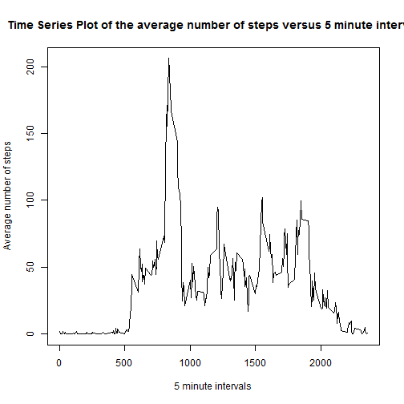
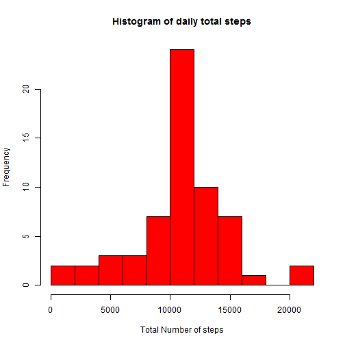
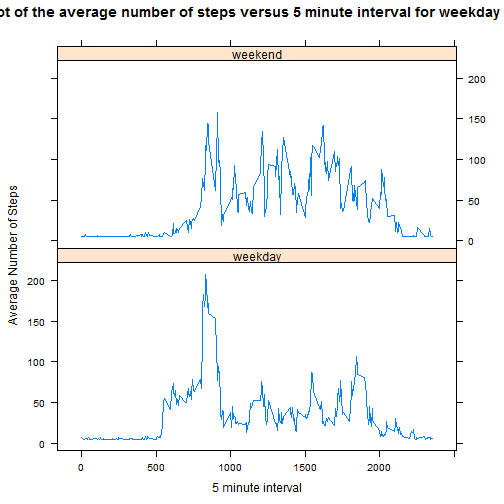

This is an R Markdown document. Markdown is a simple formatting syntax for authoring HTML, PDF, and MS Word documents. For more details on using R Markdown see <http://rmarkdown.rstudio.com>.

When you click the **Knit** button a document will be generated that includes both content as well as the output of any embedded R code chunks within the document. You can embed an R code chunk like this:
##Peer Assignment1 Reproducible Research

###Loading and processing data by removing missing data


```r
if(!file.exists("getdata-projectfiles-UCI HAR Dataset.zip")) {
        temp <- tempfile()
        download.file("http://d396qusza40orc.cloudfront.net/repdata%2Fdata%2Factivity.zip",temp)
        unzip(temp)
        unlink(temp)
}

active <- read.csv("activity.csv")

head(active)
```

```
##   steps       date interval
## 1    NA 2012-10-01        0
## 2    NA 2012-10-01        5
## 3    NA 2012-10-01       10
## 4    NA 2012-10-01       15
## 5    NA 2012-10-01       20
## 6    NA 2012-10-01       25
```

```r
#subset complete data 
actComplete <- active[complete.cases(active),]
```

###What is the mean total number of daily steps also plot histogram.


```r
#calulate daily sum of steps
sumSteps <- aggregate(steps ~ date, actComplete, sum)

#rename sum of steps 
names(sumSteps)[2] <- "dailySteps"

#veiw column names and first six rows
head(sumSteps)
```

```
##         date dailySteps
## 1 2012-10-02        126
## 2 2012-10-03      11352
## 3 2012-10-04      12116
## 4 2012-10-05      13294
## 5 2012-10-06      15420
## 6 2012-10-07      11015
```

```r
#plot histogram
hist(
        sumSteps$dailySteps,
        col = "red",
        main = "Histogram of daily total steps",
        xlab = "Total Number of steps",
        breaks = 10
)
```

 

```r
#calculate mean steps
mean(sumSteps$dailySteps)
```

```
## [1] 10766.19
```

```r
#calculate median steps
median(sumSteps$dailySteps)
```

```
## [1] 10765
```

###What is the average daily actiivity pattern.


```r
meanSteps <- aggregate(steps ~ interval, actComplete, mean)

names(meanSteps)[2] <- "averageSteps"

head(meanSteps)
```

```
##   interval averageSteps
## 1        0    1.7169811
## 2        5    0.3396226
## 3       10    0.1320755
## 4       15    0.1509434
## 5       20    0.0754717
## 6       25    2.0943396
```

```r
plot(
        x = meanSteps$interval,
        y = meanSteps$averageSteps,
        type = "l",
        main = "Time Series Plot of the average number of steps versus 5 minute interval",
        xlab = "5 minute intervals",
        ylab = "Average number of steps"
)
```

 

```r
meanSteps[meanSteps$averageSteps==max(meanSteps$averageSteps),]
```

```
##     interval averageSteps
## 104      835     206.1698
```

###Impute missing  data replace missing data with mean steps and recalculate the mean and median


```r
nrow(active[is.na(active$steps),])
```

```
## [1] 2304
```

```r
#create file to impute data
actImpute<-active

#impute data, replace na with mean
actImpute$steps[is.na(actImpute$steps)] <- round(mean(actImpute$steps, na.rm = TRUE))

#check number of rows with missing data to ensure imputation was successful  
nrow(actImpute[is.na(actImpute$steps),])
```

```
## [1] 0
```

```r
#calulate daily sum of steps for imputed data
sumSteps2 <- aggregate(steps ~ date, actImpute, sum)

#rename sum of steps 
names(sumSteps2)[2] <- "dailySteps"

#veiw column names and first six rows
head(sumSteps2)
```

```
##         date dailySteps
## 1 2012-10-01      10656
## 2 2012-10-02        126
## 3 2012-10-03      11352
## 4 2012-10-04      12116
## 5 2012-10-05      13294
## 6 2012-10-06      15420
```

```r
#plot histogram
hist(
        sumSteps2$dailySteps,
        col = "red",
        main = "Histogram of daily total steps",
        xlab = "Total Number of steps",
        breaks = 10
)
```

 

```r
#calculate mean steps for imputed data
mean(sumSteps2$dailySteps)
```

```
## [1] 10751.74
```

```r
median(sumSteps2$dailySteps)
```

```
## [1] 10656
```

###Are there differences in activity patterns between weekdays and weekends


```r
actWeek<-actImpute

weekend <- weekdays(as.Date(actWeek$date)) %in% c("Saturday", "Sunday")

actWeek$weekday_or_weekend <- "weekday"

actWeek$weekday_or_weekend[weekend == TRUE] <- "weekend"

actWeek$weekday_or_weekend <- as.factor(actWeek$weekday_or_weekend)

head(actWeek)
```

```
##   steps       date interval weekday_or_weekend
## 1    37 2012-10-01        0            weekday
## 2    37 2012-10-01        5            weekday
## 3    37 2012-10-01       10            weekday
## 4    37 2012-10-01       15            weekday
## 5    37 2012-10-01       20            weekday
## 6    37 2012-10-01       25            weekday
```

```r
str(actWeek)
```

```
## 'data.frame':	17568 obs. of  4 variables:
##  $ steps             : num  37 37 37 37 37 37 37 37 37 37 ...
##  $ date              : Factor w/ 61 levels "2012-10-01","2012-10-02",..: 1 1 1 1 1 1 1 1 1 1 ...
##  $ interval          : int  0 5 10 15 20 25 30 35 40 45 ...
##  $ weekday_or_weekend: Factor w/ 2 levels "weekday","weekend": 1 1 1 1 1 1 1 1 1 1 ...
```

```r
meanStepsW <- aggregate(steps ~ interval + weekday_or_weekend, actWeek, mean)

names(meanStepsW)[3] <- "averageStepsW"

head(meanStepsW)
```

```
##   interval weekday_or_weekend averageStepsW
## 1        0            weekday      6.955556
## 2        5            weekday      5.333333
## 3       10            weekday      5.088889
## 4       15            weekday      5.111111
## 5       20            weekday      5.022222
## 6       25            weekday      6.244444
```

```r
library(lattice)

xyplot(
        averageStepsW ~ interval | weekday_or_weekend,
        meanStepsW,
        type = "l",
        layout = c(1,2),
        main = "Time Series Plot of the average number of steps versus 5 minute interval for weekday and weekends",
        xlab = "5 minute interval",
        ylab = "Average Number of Steps"
)
```

 

